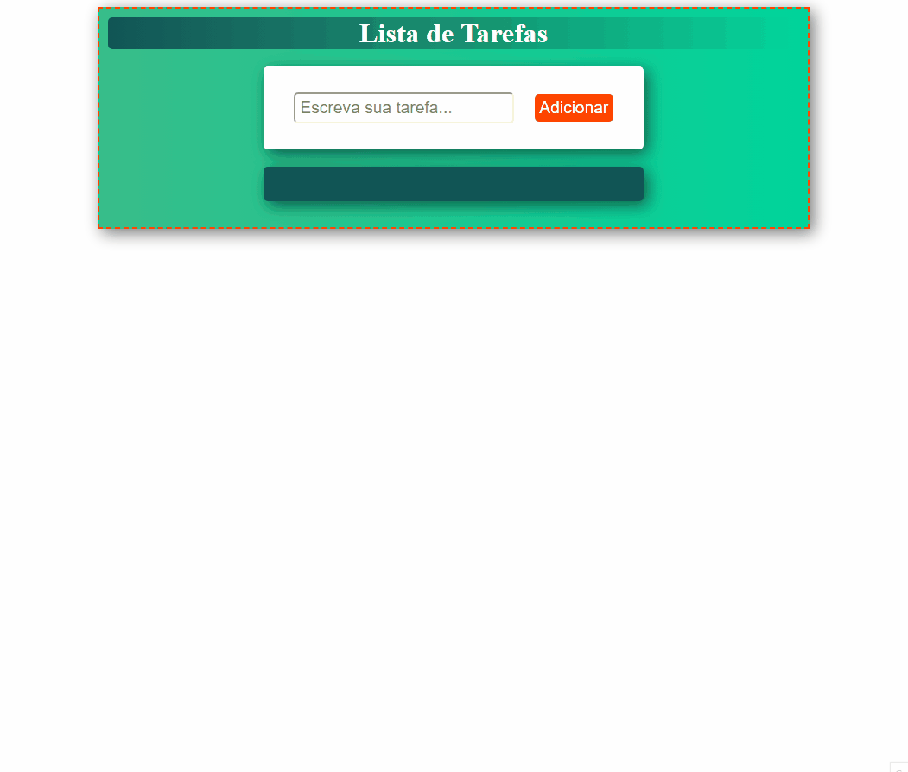

# Lista de Tarefas

Projeto utilizando HTML, CSS e JS, na qual é possível o usuário adicionar tarefas na lista de tarefas para realizar no seu dia.

[X] Fazer o frontend do projeto

[X] Criar a função para adicionar tarefas

[ ] Criar a função para remover tarefas

## Aprendizado com o Projeto
Neste projeto pessoal pude praticar como manipular os elementos DOM da página

<h1 align="center">Gif do Resultado</h1>

<h2 align="center">Tecnologias Usadas</h2>

     
 
        
        
                
    

